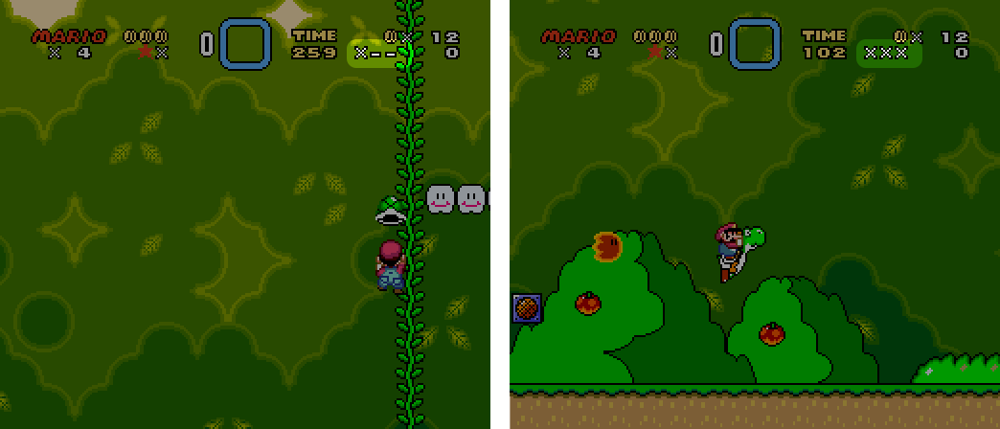

# CreditsWarpHelper
A Super Mario World romhack for learning the credits warp run

Inspired by a BizHawk script written by SethBling (featured in [this video](https://www.youtube.com/watch?v=bPa-UNS2VSM)) this ROMhack assits in practicing the setup for the [Super Mario World Credits Warp Run](deanyd.net/smw/index.php?title=Credits_Warp_Run) ([mirror](http://webcache.googleusercontent.com/search?q=cache:y2k4BCmGTRQJ:deanyd.net/smw/index.php%3Ftitle%3DCredits_Warp_Run+&cd=1&hl=en&ct=clnk&gl=us)).

#Usage
The hack looks at 3 sections of memory, each is represented by a '-' to the left of your score (score rendering is disabled to make room for this hack). As each section becomes a valid value for the credits warp to work, the '-' turns into an 'X'. The three sections are as follows:

 - Mushroom and Vine: This section is the Y position for the Mushroom and Vine Sprites. They need to be 0x37 and 0x0D.
 - Throwable Block: This is the Y position of the fragments of the throwable block. They need to be 0x00 and 0xd8-0xe5.
 - Shells: This section is the X position of all 7 shells which should be: 0x0A,0x68,0x68,0x4A,0x92,0x75,0x60
